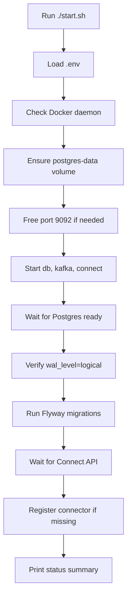
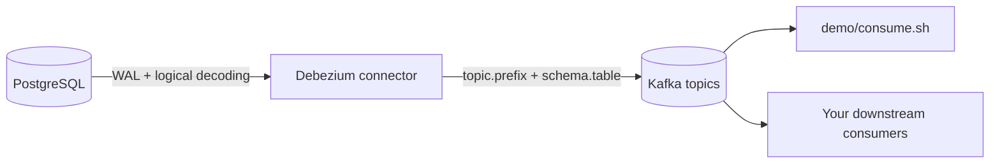

# Architecture and troubleshooting

## Startup flow

## CDC flow

Notes:

- Connector scope is configurable with `.env` values `TOPIC_PREFIX` and `TABLE_INCLUDE_LIST`.
- Topic format is `<topic.prefix>.<schema>.<table>`.

## Troubleshooting matrix

| Symptom | Likely cause | Fix |
|---|---|---|
| `./start.sh` fails with `.env not found` | `.env` was never created | Run `cp .env.example .env` and set values |
| Connector status is `FAILED` | Bad connector config or plugin mismatch | Check `curl -s http://localhost:8083/connectors/example-connector/status \| python3 -m json.tool` and `docker logs debezium-connect` |
| Health check says expected topic not found | `TOPIC_PREFIX`/`TABLE_INCLUDE_LIST` mismatch or connector not running | Verify `.env`, rerun `./start.sh`, then `./health.sh` |
| `wal_level` check fails | Postgres not started with logical decoding flags | Confirm `docker-compose.yml` has `wal_level=logical` in db command |
| POST connector command appears to hang | Used `curl --data @-` without piping input | Use `envsubst < debezium/register-postgres.json.example \| curl -X POST -H "Content-Type: application/json" --data @- http://localhost:8083/connectors` |
| Consumer shows `null` events after delete | Debezium tombstone records | This is expected for compacted-topic semantics; inspect delete event with `op: "d"` and `before` payload |
| `reset.sh` removed data unexpectedly | Reset is destructive by design | Use `./stop.sh` for non-destructive stop; use `./reset.sh --no-start` if you only need clean state |

## Quick verification checklist

1. Run `./start.sh`
2. Run `./health.sh`
3. In terminal 1 run `./demo/consume.sh`
4. In terminal 2 run `./demo/run.sh`
5. Confirm insert/update/delete events appear for your configured topic scope
